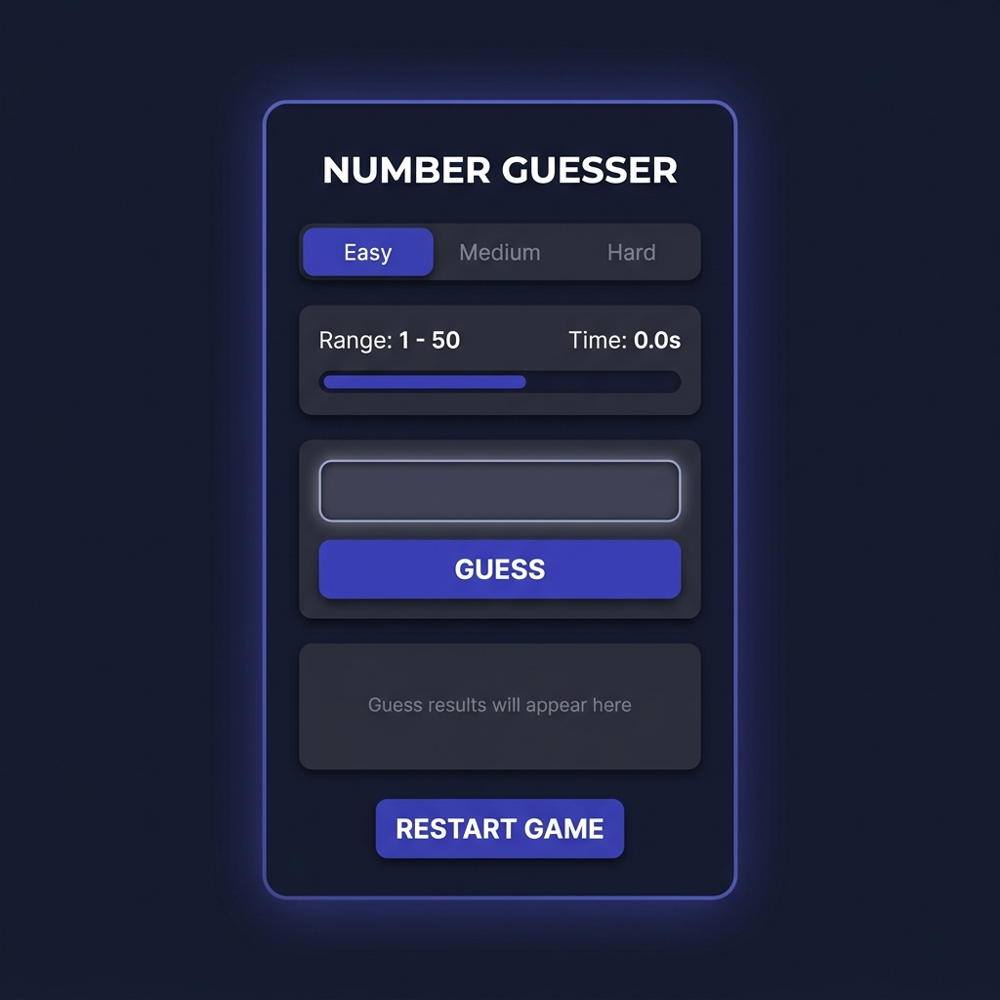

# 🎯 Number Guessing Game - Tkinter Edition

A premium, modern, desktop-based GUI application built with Python and Tkinter. This project demonstrates a clean decoupling of core game logic from visual representation (MVP/MVC pattern), custom canvas-drawn widgets, state tracking, and fluid error animations.

---

## 📸 Application Preview

Below is the desktop interface of the game, designed with a custom dark-mode theme, sleek card-based container, and modern typography:



---

## ✨ Features

- **Decoupled Architecture**: Clean separation between game logic ([game/logic.py](file:///d:/Python%20Projects/Number%20Guessing%20Game/game/logic.py)) and user interface ([gui/app.py](file:///d:/Python%20Projects/Number%20Guessing%20Game/gui/app.py)).
- **Custom Modern Widgets**:
  - **Segmented Control**: Pill-shaped difficulty selector (`Easy`, `Medium`, `Hard`) that resets the scope dynamically.
  - **Canvas Progress Bar**: A sleek, animated remaining attempts bar drawn on a native Tkinter canvas.
  - **Styled Buttons**: Flat flat-design custom buttons with hover indicators.
- **Robust Input Validation**: Immediate validation on guesses. Prevents crashes on blank inputs, letters, or out-of-bound values.
- **Interactive Feedback**: Responsive color-coded status banner providing guidance (`Too High`, `Too Low`, `Success`).
- **Tactile Error Animations**: Windows shakes horizontally using high-precision offsets when invalid input is submitted.
- **Solve Timer & High Scores**: Live timing feedback tracking solve speeds and personal best score counts per difficulty tier.

---

## 📁 Project Structure

```
Number-Guessing-Game/
│
├── run.py                 # Application entry point
│
├── game/                  # Core game logic package
│   ├── __init__.py        # Logic imports exposure
│   └── logic.py           # Pure game state & logic rules
│
├── gui/                   # GUI presentation package
│   ├── __init__.py        # App imports exposure
│   ├── app.py             # Main Tkinter container & layouts
│   └── components.py      # Flat custom styled widgets
│
├── assets/                # Design assets & screenshots
│   └── preview.png        # GUI preview screenshot
│
└── .gitignore             # Git ignore file list
```

---

## ⚙️ How to Setup & Run

### Prerequisites
- Python 3.8 or higher installed on your system.

### Running the App
1. Clone or navigate to the project directory:
   ```bash
   cd "Number Guessing Game"
   ```
2. Launch the application using python:
   ```bash
   python run.py
   ```

---

## 🧠 Technical Overview

### 1. Difficulty Configuration
The game configurations are predefined in a clear layout, mapping each difficulty to its respective maximum bounds and allowed attempt limits:
- **Easy**: Ranges from `1` to `50` (10 turns allowed)
- **Medium**: Ranges from `1` to `100` (7 turns allowed)
- **Hard**: Ranges from `1` to `200` (5 turns allowed)

### 2. Loose Coupling
The GUI listens for events and queries the game logic module. All logical validation exceptions raised in the core file are caught by the GUI layer to display human-friendly statuses without interrupting the Tkinter execution stack.
